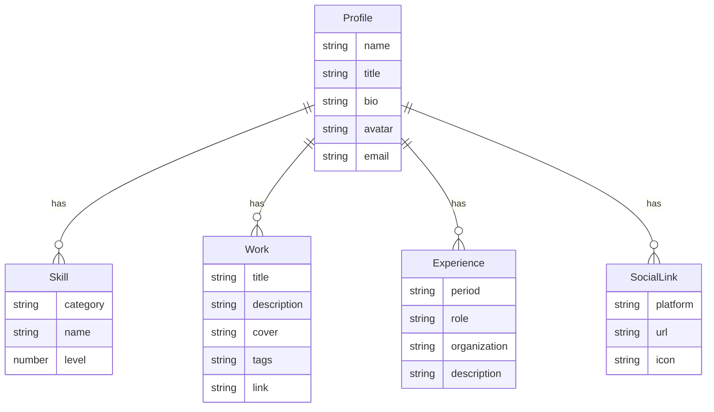

## 1. 架构设计

```mermaid
flowchart TD
    subgraph "前端层"
        "React 18 应用" --> "Three.js 3D 场景"
        "React 18 应用" --> "Canvas 2D 可视化"
        "React 18 应用" --> "GSAP 动画系统"
        "React 18 应用" --> "Tailwind 样式层"
    end
    subgraph "数据层"
        "本地静态数据" --> "个人信息 JSON"
        "本地静态数据" --> "技能数据"
        "本地静态数据" --> "作品列表"
        "本地静态数据" --> "经历时间线"
    end
    subgraph "外部服务"
        "社交链接跳转"
        "mailto 邮件发送"
    end
    "前端层" --> "数据层"
    "前端层" --> "外部服务"
```

## 2. 技术说明
- **前端框架**:React@18 + TypeScript@5
- **构建工具**:Vite@5(vite-init 初始化)
- **样式方案**:TailwindCSS@3 + CSS 变量(主题色/字体令牌)
- **3D 渲染**:three@0.160 + @react-three/fiber@8 + @react-three/drei@9 + @react-three/postprocessing@2
- **2D 可视化**:原生 Canvas 2D API(雷达图、流动背景)
- **动画系统**:GSAP@3.12 + @gsap/react(ScrollTrigger、useGSAP)
- **字体**:Google Fonts(Fraunces + JetBrains Mono)
- **后端**:无(纯静态站点)
- **数据**:本地 TypeScript 常量文件(mock 数据)

## 3. 路由定义
| 路由 | 用途 |
|------|------|
| `/` | 单页主页,包含全部章节(锚点导航:#hero #about #skills #works #timeline #contact) |

## 4. 数据模型

### 4.1 数据模型定义


### 4.2 数据定义
```typescript
// src/data/profile.ts
export interface Profile {
  name: string;
  title: string;
  bio: string;
  avatar: string;
  email: string;
}

export interface Skill {
  category: 'frontend' | 'backend' | 'design' | 'tools' | 'soft';
  name: string;
  level: number; // 0-100
}

export interface Work {
  id: string;
  title: string;
  description: string;
  cover: string;
  tags: string[];
  link: string;
}

export interface Experience {
  id: string;
  period: string;
  role: string;
  organization: string;
  description: string;
}

export interface SocialLink {
  platform: string;
  url: string;
  icon: string;
}
```

## 5. 性能优化策略
- **3D 场景**:`frameloop="demand"` 配合手动 invalidate,离屏暂停;粒子数按设备分级;使用 `InstancedMesh` 复用几何体
- **图片**:作品封面使用 `loading="lazy"`,提供 `srcset` 多尺寸
- **字体**:`font-display: swap`,预加载关键字体子集
- **GSAP**:使用 `ScrollTrigger.matchMedia` 区分设备;动画使用 `will-change` 提示;`batch` 处理多元素入场
- **打包**:Vite 代码分割,three.js 单独 chunk,按需引入 drei 组件
- **首屏**:Hero 内容 SSR 友好(纯 HTML 文字),3D canvas 延迟挂载
